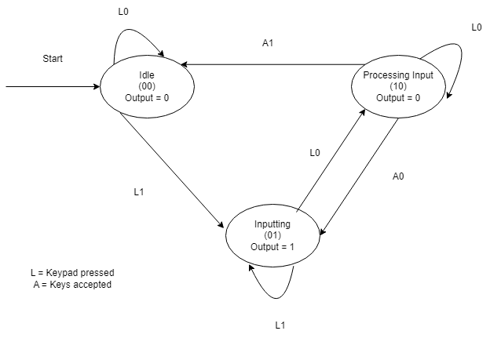
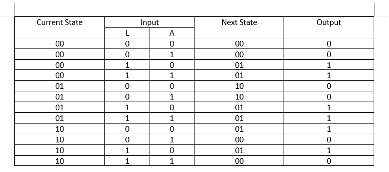
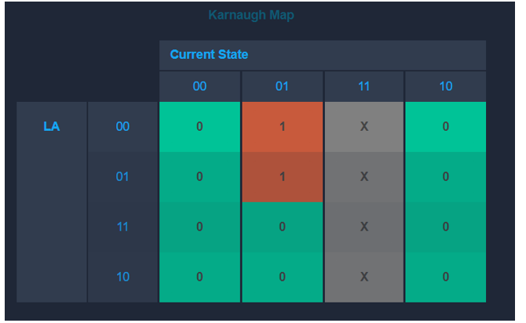
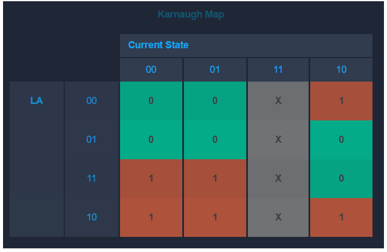
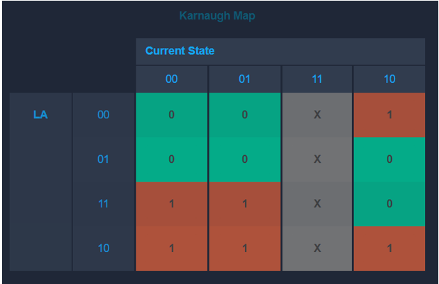

# FSM-Final Project (Keypad System)

I am Wallace from L1BC here to show my FSM Final Project

The real example of a system that I took was:
**Keypad system** 

### FSM Diagram

### State and transition table

### Karnaugh Map
- ##### Next State (s0') Karnaugh Map

- ##### Next State (s1') Karnaugh Map

- ##### Output Karnaugh Map

## Visualisation

- ### Idle (00)

- ### Inputting (01)

- ### Accepted (10)

